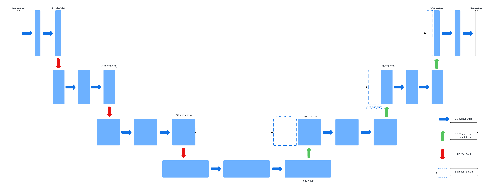
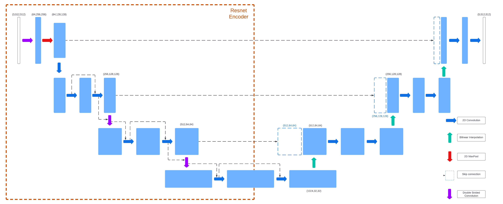
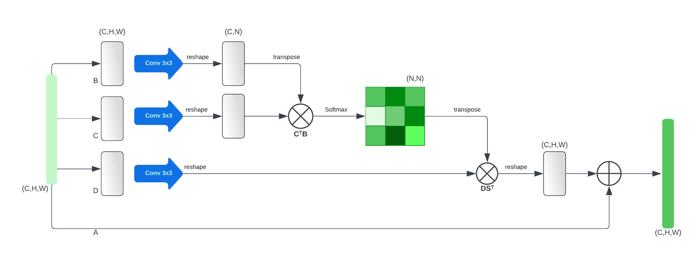
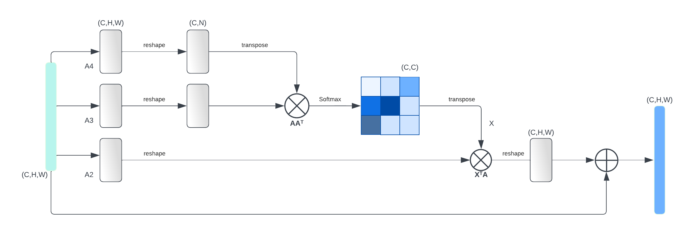
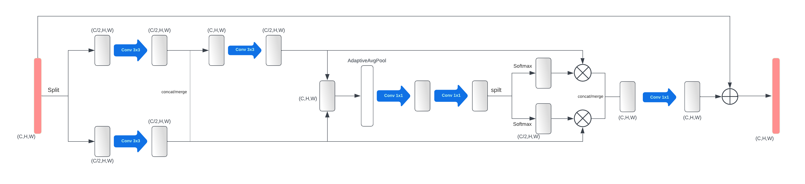

# Experimental Analysis on Diabetic Retinopathy Lesion Segmentation

For my final computer science project, I took on the research based problem of Diabetic Retinopathy (DR) detection through lesion segmentation. This project involved applying research in the field of image segmentation to the particularly challenging task of segmenting lesions in fundus images. The project was conducted under the supervision of Dr. Kashif Rajpoot. The project was conducted at the University of Birmingham, School of Computer Science.

My goal for mastering deep learning has always been to bring a positive impact through the field, and this project was inspired by the potential to make a difference in the lives of millions of people starting from my uncle who is afflicted by this condition.  

## Introduction

Medical image segmentation plays a crucial role in the diagnosis and treatment
of many diseases, including diabetic retinopathy (DR). DR is a leading cause
of blindness and involves abnormalities in the blood vessels of the retina. In
this study, we investigate the effects of different U-Net models for DR lesion
segmentation and identify best approaches for more accurate segmentation using limited data. In
this work, we perform experiments on U-Net model architectures, training
approaches, image preprocessing techniques, and loss functions. Our
contributions include identifying binary class map weighting as a solution for
more accurate segmentation of the microaneurysm class. This study provides
insights into improving the accuracy of DR lesion segmentation, which could
ultimately aid in the effective diagnosis and treatment of DR.

In this project, we have conducted experiments to explore different U-Net architectures
and related techniques for DR lesion segmentation. Specifically, we have investigated the
impact of using different pre-trained encoders, attention mechanisms, and multi-task training
approaches on the performance of U-Net-based models for lesion segmentation. We have also
evaluated the effectiveness of various loss functions and preprocessing techniques in enhancing
the segmentation results.

## Technical Approach

For fair and reliable comparisons, we have developed all the models, training pipelines, as well as evaluation pipelines using the PyTorch deep learning framework ourselves. 

The data for this project was sourced from the [retinal-lesions dataset](https://github.com/WeiQijie/retinal-lesions), where the dataset was originally introduced in the paper 'Learn to Segment Retinal Lesions and Beyond' by Qijie Wei and team, presented at the International Conference on Pattern Recognition (ICPR) in 2020 [1]. We would like to express our gratitude to the authors for providing this valuable dataset, which forms the foundation of our research and experimentation.

**Citation:**
Q. Wei, X. Li, W. Yu, et al., "Learn to Segment Retinal Lesions and Beyond," *International Conference on Pattern Recognition (ICPR)*, 2020.

Once more, for reliable results the evaluation pipeline utilized an underlying metric library called [miseval](https://github.com/frankkramer-lab/miseval).

**Citation:**
D. Müller, D. Hartmann, P. Meyer, F. Auer, I. Soto-Rey, F. Kramer, "MISeval: a Metric Library for Medical Image Segmentation Evaluation," *Studies in Health Technology and Informatics*, vol. 294, pp. 33-37, 2022. doi: [10.3233/shti220391](https://doi.org/10.3233/shti220391)

### Model Training and Evaluation

The model training and evaluation file can be found in `Experiments/Experiments_on_retinal_lesions_main.ipynb.` This file is divided into appropriate sections for easier navigation, and contains the training logs for some of the models.

### Demonstration

For a demonstration of the trained models, predictions, and evaluation please visit the link below and follow the instructions provided.

Link to google colab : https://colab.research.google.com/

For any issues or queries contact : maa089@alumni.bham.ac.uk

## Methodology

The U-Net architecture is a popular choice for medical image segmentation tasks and it serves as the basis for our models. The U-Net consists of an encoder-decoder architecture with skip connections between the subsequent convolutional blocks in the encoder and decoder. The skip connections help in preserving the spatial information and allow for better flow of gradients during training. However, the base U-Net isn't equipped to handle the complex and diverse nature of the DR lesions (with limited data) thus, we have experiemented with different additions to the base U-Net architecture. Along with varied model architectures, we also experimented with training approaches, and loss functions.

### U-Net with Pre-trained Encoders

Using a pre-trained conv-net as the encoder in U-Net architecture is a significant improvement
known as transfer learning. It has been shown to enhance performance, reduce training time, and
computational resources. The pre-trained conv-net enables the U-Net to leverage learned feature
representations, especially when training data is limited.

### U-Net with Attention Mechanism

Attention is a mechanism that was utilized in the Transformer architecture to improve
performance in the task of machine translation by training the model to ‘pay attention’ to words
that offer more context, this mechanism has been adapted to computer vision tasks to train models
to selectively focus on regions of the image that more important to the task. In the context of the
U-Net, the use of attention mechanisms can enhance the features extracted from the encoder
which can improve the performance of the model in image segmentation. This work looks at two
types of attention mechanisms: 

- dual attention
- compact-split-attention

#### Dual Attention

Dual attention is mechanism that enhances a model’s ability to capture global features within
images, it consists of two parts: position attention, and channel attention. 

#### Compact-Split-Attention

Compact split attention (CSA4) is a novel attention mechanism introduced to improve the
performance of segmentation for medical imaging whereas dual attention was utilized for scene
segmentation.

### Training Approaches

Multi-task training involves training the model with an additional task alongside the primary
segmentation task, the additional task may vary depending on the goals of the training. Multi-task
training can lead to an increase in the performance of the primary task by developing more robust
representations of the data due to being trained on multiple tasks simultaneously.

#### Lesion Profile Classification

To address the challenge of distinguishing between the two classes of lesions in DR lesion
segmentation, a lesion profile can be used alongside the segmentation output. The lesion profile is
a class-wise vector composed of probabilities of whether a particular lesion is present within the
image. It can be obtained by applying global max-pooling along the class dimension of the
segmentation output, resulting in a class-wise vector with a score representing the probability that
the lesion is present within the image.

#### Binary Class Map Weighting

Microaneurysms are small and subtle lesions that are challenging to detect in DR images. In
order to address this issue, we have proposed the use of binary BCM5 weighting. This technique
allows the model to focus more on the difficult class that it is performing poorly on. BCM weighting
computes a binary segmentation loss on a selected class from the multi-class segmentation output,
which helps the model pay more attention to the specific class of lesions that are harder to detect,
such as microaneurysms.

Loss functions ommited for brevity.

## Results

To comprehensively evaluate the performance of the models, we have conducted both qualitative and quantitative analyses. The qualitative analysis involves visualizing the segmentation results of the models on the test set, while the quantitative analysis involves computing the performance metrics such as Dice coefficient, Jaccard index, sensitivity, specificity, and the F1 score. The quantitative analysis is conducted on both the individual lesion classes as well as the combined performance.

For brevity we inclue results from only a few experiments.

### U-Net with Pre-trained Encoders

| Model Name | Cotton Wool Spots | Hard Exudate | Microaneurysm | Retinal Hemorrhage |
|------------|-------------------|--------------|---------------|--------------------|
| simple_vgg_unet | 0.223 | 0.606 | 0.235 | 0.447 |
| complex_vgg_unet | 0.274 | 0.596 | 0.198 | 0.425 |
| simple_res_unet | 0.358 | 0.625 | 0.208 | 0.476 |
| complex_res_unet | 0.374 | 0.627 | 0.201 | 0.459 |
| simple_b4_unet | 0.305 | 0.593 | 0.131 | 0.449 |
| complex_b4_unet | 0.235 | 0.555 | nan | 0.432 |

A look at the class specific F1 scores (in the table above) shows that the ResNet encoder models are performing significantly better than others at segmenting cotton wool spots, while also performing better than other models at segmenting hard exudates and retinal hemorrhages. This shows that ResNet based models are better suited at segmenting the yellow lesions.

Moreover, the segmentation of microaneurysms was found to be particularly challenging, as evidenced by the poor performance of all models on this class. In particular, the EfficientNet-based models exhibited inferior results, with the complex_b4_unet failing to segment microaneurysms altogether.

### U-Net with Attention Mechanism

Applying dual attention has led to an insignificant improvement in performance for the vgg_unet however, the same has resulted in a sizeable decline in the performance of ResNet and EfficientNet based U-Nets as seen by observing the DSC and IoU score in TABLE 2. On the other hand, the addition of CSA attention has led to a significant improvement across all metrics for the VGG and ResNet based U-Nets with the csa_res_unet performing the best out of all listed U-Nets within the same table.

### Binary Class Map Weighting

The figure below further illustrates the superior performance of the BCM trained U-Net on the microaneurysm class compared to the same model trained using the standard approach. The simple_res_unet classifies the microaneurysm as the retinal hemorrhage more often than the model trained using BCM. Additionally, an increase in performance over all other lesions can be observed for the bcm_res_unet_015. 

## Conclusion

Through extensive experimentation, this work aimed to identify key characteristics for achieving higher performance in the DR lesion segmentation task. We analyzed different model architectures and mechanisms and found that using a pretrained encoder, a simple decoder, and the CSA attention module resulted in significant performance gains. We also analyzed the result different training approaches and observed that both multi-task training and the proposed binary-class-map weighting achieved their respective goals and resulted in performance gains in certain areas. 

Due to logistical limitations, our experiments were restricted to a narrow range of pretrained encoders and decoder variations. Future work could focus on experimenting with combinations of model architectures and training approaches, including exploring how different aspects interact. For example, investigating whether combining CSA attention and BCM training would further increase the performance of already best-performing networks. Additionally, developments into the decoder of the U-Net could be explored, such as the idea of using a pretrained decoder.